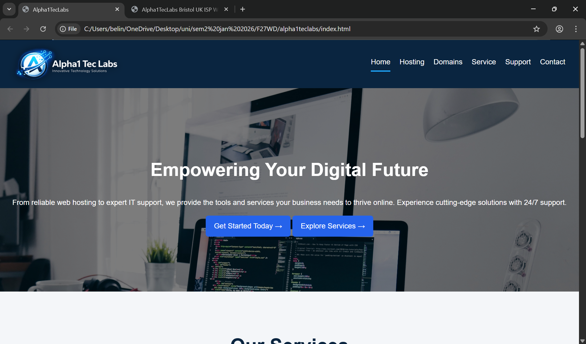
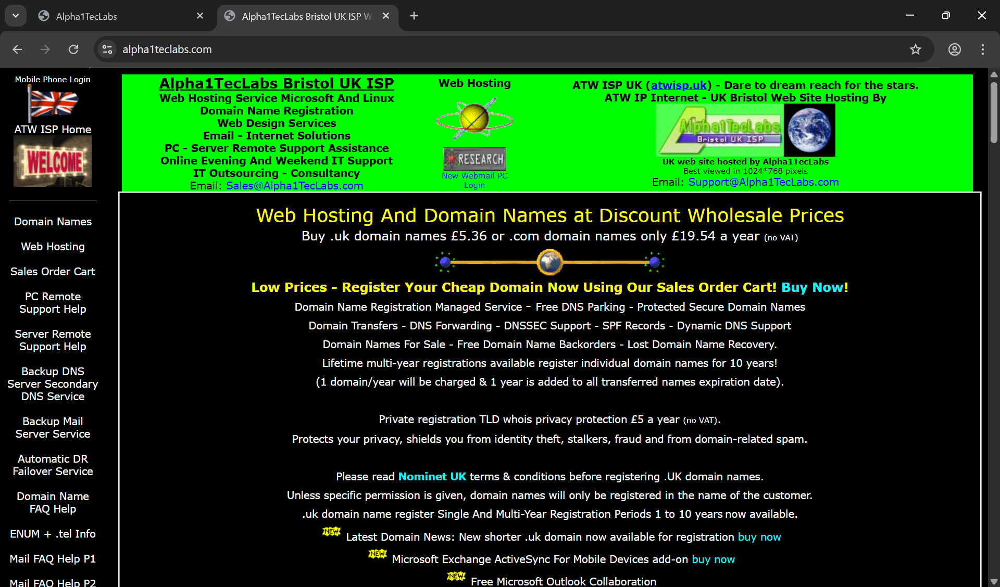

# alpha1teclabs

Project Description/n
This project is a redesigned version of a previously unusable website assigned as part of university coursework.
The objective was to improve usability and navigation by focusing on user experience (UX).

The website was rebuilt using HTML, CSS, and JavaScript, and deployed locally using XAMPP.

Usage/n
The interface is designed to be intuitive and easy to navigate. Users can quickly access information with minimal effort, reflecting the project's focus on usability.

Demo video: https://canva.link/skhg14a0xqhg2sl

Features

